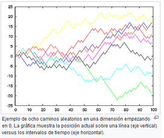
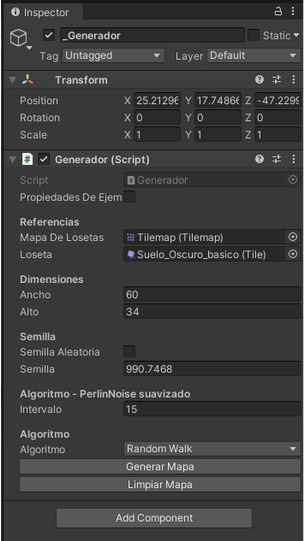
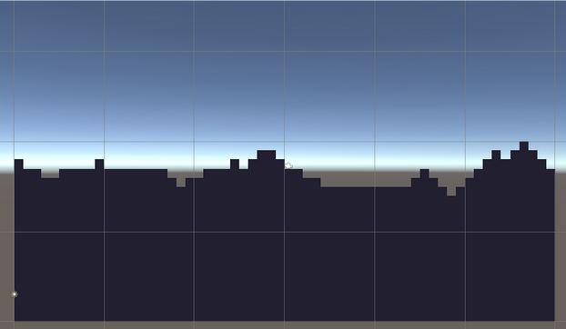

## Random Walk

#### Introducción

### Random Walk Básico

En la Wikipedia :
La caminata aleatoria o paseo aleatorio o camino aleatorio, abreviado en inglés como RW (Random Walks), es una formalización matemática de la trayectoria que resulta de hacer sucesivos pasos aleatorios. Por ejemplo, la ruta trazada por una molécula mientras viaja por un líquido o un gas, el camino que sigue un animal en su búsqueda de comida, el precio de una acción fluctuante y la situación financiera de un jugador pueden tratarse como una caminata aleatoria. El término caminata aleatoria fue introducido por Karl Pearson en 1905.

La forma en que funciona este algoritmo es lanzando una moneda. Entonces obtenemos uno de dos resultados. Si el resultado es cara, subimos un bloque, si el resultado es cruz, bajamos un bloque. Esto crea algo de altura a nuestro nivel moviéndose siempre hacia arriba o hacia abajo. El único inconveniente de este algoritmo es que se ve muy bloqueado. Echemos un vistazo a cómo funciona.
Esta generación nos brinda una altura más suave en comparación con la generación de ruido Perlin.
Algoritmo:
public static void RandomWalk(int[,] _mapa, float _semilla)
    {
        // La semilla de nuestro random
        Random.InitState( _semilla.GetHashCode()); // obtiene el valor entero del valor real

        // Altura desde la cual vamos a dibujar el mapa
        int ultimaAltura = Random.Range(0, _mapa.GetUpperBound(1));

        // Recorremos el mapa a lo ancho - X
        for (int x = 0; x <= _mapa.GetUpperBound(0); x++)
        {
            // 0 Sube, 1 Baja, 2 igual
            int sigMovimiento = Random.Range(0, 3);

            // SUBIR
            if (sigMovimiento == 0 && ultimaAltura < _mapa.GetUpperBound(1))
            {
                ultimaAltura++;
            }

            // BAJAR
            else if (sigMovimiento == 1 && ultimaAltura > 0)
            {
                ultimaAltura--;
            }

            // no cambia la altura si sigMoviento == 2

	
            for (int y = ultimaAltura; y >= 0; y--)
            {
                _mapa[x, y] = 1;
            }

        }
        
    }

